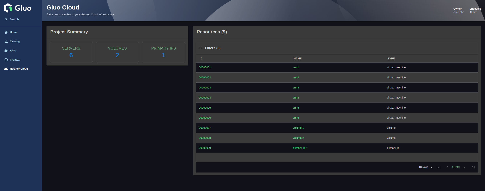

# Backstage Hetzner Plugin

A Backstage plugin that integrates with Hetzner Cloud to provide insight into your cloud infrastructure. It offers an intuitive interface for visualizing Hetzner Cloud resources such as virtual machines, volumes, and primary IPs, all accessible directly within your Backstage environment.

## Table of Contents

- [Backstage Hetzner Plugin](#backstage-hetzner-plugin)
  - [Table of Contents](#table-of-contents)
  - [Features](#features)
  - [Installation](#installation)
    - [1. Frontend Plugin](#1-frontend-plugin)
    - [2. Backend Plugin](#2-backend-plugin)
    - [3. Catalog Backend Module Plugin](#3-catalog-backend-module-plugin)
  - [Configuration](#configuration)
    - [Frontend Configuration](#frontend-configuration)
    - [Backend Configuration](#backend-configuration)
    - [Catalog Backend Module Configuration](#catalog-backend-module-configuration)
  - [Usage](#usage)
  - [Development](#development)
    - [Getting Started](#getting-started)
    - [Backend Development](#backend-development)
    - [Frontend Development](#frontend-development)
    - [Running Tests](#running-tests)
  - [Contributing](#contributing)
  - [License](#license)
    - [Attribution](#attribution)

## Features

The Hetzner Cloud to Backstage plugin needs to give a comprehensive insight into the Hetzner cloud platform.
There are two views that provide information:

- **Index Page**: Gives an overview of the Hetzner Cloud Platform in general.

  

- **Resource Card**: Gives details about which resources are used and what runs where. This view is available in a tab in each component that uses Hetzner's resources.

  

## Installation

To get started, install all required plugins for a complete Hetzner Cloud integration in Backstage:

### 1. Frontend Plugin

Install the Hetzner Cloud frontend plugin in your Backstage app:

```bash
# From the Backstage root directory
yarn --cwd packages/app add @gluo-nv/backstage-plugin-hetzner
```

For more details, see the [frontend plugin documentation](./plugins/hetzner/README.md).

### 2. Backend Plugin

Install the Hetzner Cloud backend plugin to enable API integration:

```bash
# From the Backstage root directory
yarn --cwd packages/backend add @gluo-nv/backstage-plugin-hetzner-backend
```

For more details, see the [backend plugin documentation](./plugins/hetzner-backend/README.md).

### 3. Catalog Backend Module Plugin

Install the Hetzner Cloud catalog backend module to sync Hetzner resources into the Backstage catalog:

```bash
# From the Backstage root directory
yarn --cwd packages/backend add @gluo-nv/backstage-plugin-catalog-backend-module-hetzner
```

For more details, see the [catalog backend module documentation](./plugins/catalog-backend-module-hetzner/README.md).

## Configuration

### Frontend Configuration

Add the following to the `app-config.yaml` to configure the frontend plugin:

```yaml
app:
  hetzner:
    project:
      title: <Hetzner project title>
      owner: <Hetzner project owner>
      lifecycle: <Hetzner project lifecycle>
```

1. Add the plugin to the Backstage application by modifying the `packages/app/src/App.tsx`:

```tsx
import { HetznerPage } from '@gluo-nv/backstage-plugin-hetzner';
```

Add the `Hetzner Cloud` page to the sidebar

```tsx
const routes = (
  <FlatRoutes>
    {/* ...other routes*/}
    <Route path="/hetzner" element={<HetznerPage />} />
  </FlatRoutes>
);
```

2.  ``packages/app/src/components/Root/Root.tsx`

Add the icon import:

```tsx
import Cloud from '@material-ui/icons/Cloud';
```

3. Then add this line just before the `</SidebarGroup>` line:

```tsx
export const Root = ({ children }: PropsWithChildren<{}>) => (
  <SidebarPage>
    <Sidebar>
      {/*...*/}
      <SidebarGroup label="Menu" icon={<MenuIcon />}>
        {/* Global nav, not org-specific */}
        {/*...other sidebar items*/}
        <SidebarItem icon={Cloud} to="hetzner" text="Hetzner Cloud" />
        {/* End global nav */}
        <SidebarDivider />
        {/*...*/}
      </SidebarGroup>
      {/*...*/}
    </Sidebar>
    {children}
  </SidebarPage>
);
```

4. Add the Hetzner Resources Card to the entity overview page

Add a new file `utils.tsx` in `packages/app/src/components/catalog`:

```tsx
import { Entity } from '@backstage/catalog-model';

export const isHetznerResource = (entity: Entity): boolean => {
  const hetznerData = entity.metadata.annotations?.['hetzner.com/data'];
  try {
    return hetznerData !== undefined && JSON.parse(hetznerData) !== null;
  } catch (e) {
    return false;
  }
};
```

Add the Resources Card in `packages/app/src/components/catalog/EntityPage.tsx`

```tsx
import { EntityHetznerContent } from '@gluo-nv/backstage-plugin-hetzner';
import { isHetznerResource } from './utils';

// Add to the overview content:
const overviewContent = (
  <Grid container spacing={3} alignItems="stretch">
    {entityWarningContent}
    <Grid item md={6}>
      <EntityAboutCard variant="gridItem" />
    </Grid>
    <Grid item md={6} xs={12}>
      <EntityCatalogGraphCard variant="gridItem" height={400} />
    </Grid>

    {/* Hetzner Cloud Plugin */}
    <EntitySwitch>
      <EntitySwitch.Case
        if={entity => isKind('resource')(entity) && isHetznerResource(entity)}
      >
        <Grid item md={6}>
          <EntityHetznerContent />
        </Grid>
      </EntitySwitch.Case>
    </EntitySwitch>
    {/* Hetzner Cloud Plugin */}

    {/*...*/}
  </Grid>
);
```

### Backend Configuration

Add the following to the `app-config.yaml` to configure the backend plugin:

```yaml
backend:
  hetzner:
    token: ${HCLOUD_TOKEN}
```

Add the plugin to the backend in `packages/backend/src/index.ts`:

```typescript
backend.add(import('@gluo-nv/backstage-plugin-hetzner-backend'));
```

### Catalog Backend Module Configuration

Add the plugin to the backend in `packages/backend/src/index.ts`:

```typescript
backend.add(import('@gluo-nv/backstage-plugin-catalog-backend-module-hetzner'));
```

## Usage

Once installed and configured, you can:

1. View an overview of the Hetzner Cloud infrastructure directly in Backstage
2. Inspect details of Hetzner resources (servers, volumes, primary IPs)
3. Navigate and filter Hetzner resources as part of the Backstage catalog experience

## Development

### Getting Started

1. Clone the repository
2. Install dependencies:

```bash
yarn install
```

### Backend Development

To start the backend plugin in development mode:

```bash
# From the backend plugin directory
yarn start
```

This starts the backend in standalone mode on http://localhost:7007.

### Frontend Development

To run the frontend plugin in isolation:

```bash
# From the frontend plugin directory
yarn start
```

### Running Tests

```bash
yarn test
```

## Contributing

We welcome contributions to improve this plugin! If you’d like to contribute, please follow these steps:

1. Fork the repository.
2. Create a new branch for the feature or bug fix.
3. Submit a pull request with a clear description of the changes.

For major changes, please open an issue first to discuss the ideas.

## License

This plugin is licensed under the GNU Affero General Public License v3.0 (AGPL-3.0).

### Attribution

This plugin was created by [Gluo NV](https://gluo.be).  
Any use or distribution must include proper attribution to the original author.
