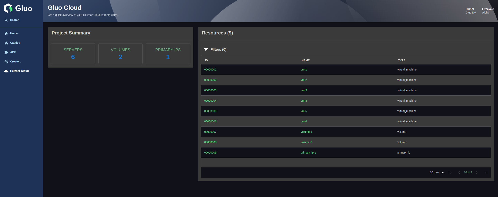
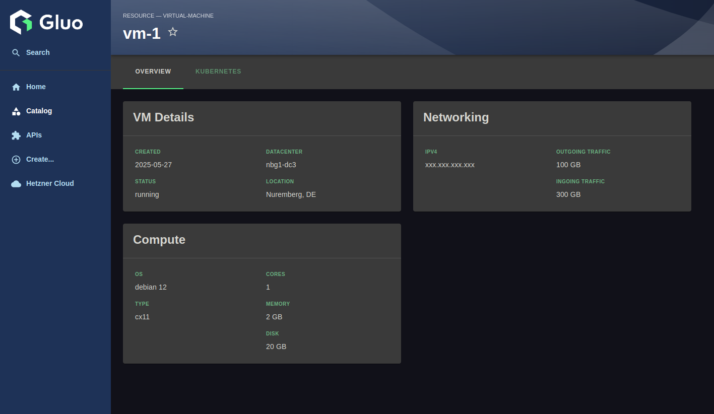

# Backstage Hetzner Plugin

A plugin for Backstage that integrates with Hetzner Cloud. This plugin allows you to:

- View an overview of your Hetzner Cloud infrastructure directly in Backstage
- Inspect details of Hetzner resources (servers, volumes, IPs, etc.) via the Index Page
- Navigate and filter Hetzner resources as part of your Backstage catalog experience

## Table of Contents

- [Backstage Hetzner Plugin](#backstage-hetzner-plugin)
  - [Table of Contents](#table-of-contents)
  - [Features](#features)
  - [Installation](#installation)
    - [Frontend Plugin](#frontend-plugin)
    - [Backend Plugin](#backend-plugin)
    - [Catalog Backend Module Plugin](#catalog-backend-module-plugin)
    - [Configuration](#configuration)
    - [Frontend Configuration](#frontend-configuration)
  - [Development](#development)
    - [Getting Started](#getting-started)
    - [Running Tests](#running-tests)
    - [Building](#building)
    - [Custom test environment](#custom-test-environment)
  - [Contributing](#contributing)
  - [License](#license)
    - [Attribution](#attribution)

## Features

The Hetzner Cloud to Backstage plugin needs to give a comprehensive insight into the Hetzner cloud platform.
There are two views that provide information:

- **Index Page**: Gives an overview of the Hetzner Cloud Platform in general.

  

- **Resource Card**: Gives details about which resources are used and what runs where. This view is available in a tab in each component that uses Hetzner's resources.

  

## Installation

### Frontend Plugin

```bash
# From the Backstage root directory
yarn --cwd packages/app add @gluo-nv/backstage-plugin-hetzner
```

### Backend Plugin

This frontend plugin requires the corresponding backend plugin to be installed. Please follow the instructions in the [backend plugin directory](../hetzner-backend/README.md).

### Catalog Backend Module Plugin

This frontend plugin requires the corresponding catalog backend module plugin to be installed. Please follow the instructions in the [catalog backend module plugin directory](../catalog-backend-module-hetzner/README.md).

### Configuration

### Frontend Configuration

Add the following to the `app-config.yaml` to configure the frontend plugin:

```yaml
app:
  hetzner:
    project:
      title: <Hetzner project title>
      owner: <Hetzner project owner>
      lifecycle: <Hetzner project lifecycle>
```

1. Add the plugin to the Backstage application by modifying the `packages/app/src/App.tsx`:

```tsx
import { HetznerPage } from '@gluo-nv/backstage-plugin-hetzner';
```

Add the `Hetzner Cloud` page to the sidebar

```tsx
const routes = (
  <FlatRoutes>
    {/* ...other routes*/}
    <Route path="/hetzner" element={<HetznerPage />} />
  </FlatRoutes>
);
```

2.  ``packages/app/src/components/Root/Root.tsx`

Add the icon import:

```tsx
import Cloud from '@material-ui/icons/Cloud';
```

3. Then add this line just before the `</SidebarGroup>` line:

```tsx
export const Root = ({ children }: PropsWithChildren<{}>) => (
  <SidebarPage>
    <Sidebar>
      {/*...*/}
      <SidebarGroup label="Menu" icon={<MenuIcon />}>
        {/* Global nav, not org-specific */}
        {/*...other sidebar items*/}
        <SidebarItem icon={Cloud} to="hetzner" text="Hetzner Cloud" />
        {/* End global nav */}
        <SidebarDivider />
        {/*...*/}
      </SidebarGroup>
      {/*...*/}
    </Sidebar>
    {children}
  </SidebarPage>
);
```

4. Add the Hetzner Resources Card to the entity overview page

Add a new file `utils.tsx` in `packages/app/src/components/catalog`:

```tsx
import { Entity } from '@backstage/catalog-model';

export const isHetznerResource = (entity: Entity): boolean => {
  const hetznerData = entity.metadata.annotations?.['hetzner.com/data'];
  try {
    return hetznerData !== undefined && JSON.parse(hetznerData) !== null;
  } catch (e) {
    return false;
  }
};
```

Add the Resources Card in `packages/app/src/components/catalog/EntityPage.tsx`

```tsx
import { EntityHetznerContent } from '@gluo-nv/backstage-plugin-hetzner';
import { isHetznerResource } from './utils';

// Add to the overview content:
const overviewContent = (
  <Grid container spacing={3} alignItems="stretch">
    {entityWarningContent}
    <Grid item md={6}>
      <EntityAboutCard variant="gridItem" />
    </Grid>
    <Grid item md={6} xs={12}>
      <EntityCatalogGraphCard variant="gridItem" height={400} />
    </Grid>

    {/* Hetzner Cloud Plugin */}
    <EntitySwitch>
      <EntitySwitch.Case
        if={entity => isKind('resource')(entity) && isHetznerResource(entity)}
      >
        <Grid item md={6}>
          <EntityHetznerContent />
        </Grid>
      </EntitySwitch.Case>
    </EntitySwitch>
    {/* Hetzner Cloud Plugin */}

    {/*...*/}
  </Grid>
);
```

## Development

### Getting Started

1. Clone the repository
2. Install dependencies:

```bash
yarn install
```

3. Run the plugin in isolation

```bash
yarn start
```

### Running Tests

Run all tests:

```bash
yarn test
```

Run tests with coverage:

```bash
yarn test:coverage
```

### Building

```bash
yarn build
```

### Custom test environment

To set up a custom development environment for the Hetzner Cloud plugin, follow these steps:

1. Create or update the `dev/index.tsx` file with the following content:

```tsx
import { createDevApp } from '@backstage/dev-utils';
import {
  hetznerPlugin,
  HetznerPage,
  ResourcesCardPage,
} from '../src/plugin';

// dev
import { EntityProvider } from '@backstage/plugin-catalog-react';
import { ResourcesCard } from '../src/components/Resource/ResourcesCard';

// dev
const mockEntity = {
  apiVersion: 'backstage.io/v1alpha1',
  kind: 'Component',
  metadata: {
    name: 'mock-entity',
    annotations: {
      'hetzner.com/data': JSON.stringify({
        id: 12345,
        name: 'vm-gluo-rke2-runner-1',
        status: 'running',
        created: '2024-11-25T10:04:10+00:00',
        public_net: {
          ipv4: {
            ip: '192.168.0.1',
            dns_ptr: 'example.com',
          },
        },
        datacenter: {
          name: 'nbg1-dc3',
          description: 'Nuremberg 1 virtual DC 3',
          location: {
            city: 'Nuremberg',
            country: 'DE',
          },
        },
        server_type: {
          name: 'cx32',
          description: 'CX32',
          cores: 4,
          memory: 8,
          disk: 80,
        },
        image: {
          name: 'debian-12',
          description: 'Debian 12',
          os_flavor: 'debian',
          os_version: '12',
        },
        outgoing_traffic: 12345,
        ingoing_traffic: 67890,
        included_traffic: 100000,
        resource_type: 'virtual_machine',
      }),
    },
  },
};

createDevApp()
  .registerPlugin(hetznerPlugin)
  .addPage({
    element: <HetznerPage />,
    title: 'Root Page',
    path: '/hetzner-cloud',
  })

  // dev
  .addPage({
    title: 'Resources Card',
    element: (
      <EntityProvider entity={mockEntity}>
        <ResourcesCard />
      </EntityProvider>
    ),
    path: '/resources-card',
  })
  .render();
```

This file is the entry point for running the plugin in a standalone development environment. It allows you to test the plugin without integrating it into a full Backstage app.

2. Ensure the `src/routes.ts` file contains the following:

```ts
import { createRouteRef } from '@backstage/core-plugin-api';

export const rootRouteRef = createRouteRef({
  id: 'hetzner-cloud',
});

// dev
export const resourcesCardRouteRef = createRouteRef({
  id: 'resources-card',
});
```

This file defines the route references for the plugin. Route references are used to link components to specific paths in Backstage.

3. Ensure the `src/plugin.ts` file contains the following:

```ts
import {
  createPlugin,
  createRoutableExtension,
} from '@backstage/core-plugin-api';

import { resourcesCardRouteRef, rootRouteRef } from './routes';

export const hetznerPlugin = createPlugin({
  id: 'hetzner-cloud',
  routes: {
    root: rootRouteRef,
    resourcesCard: resourcesCardRouteRef, //dev
  },
});

// prod
// export const EntityHetznerContent = hetznerPlugin.provide(
//   createComponentExtension({
//     component: {
//       lazy: () => import ('./components/entity/ResourcesCard').then(m => m.ResourcesCard),
//     }
//   })
// );

export const HetznerPage = hetznerPlugin.provide(
  createRoutableExtension({
    name: 'HetznerPage',
    component: () =>
      import('./components/IndexComponent').then(m => m.IndexComponent),
    mountPoint: rootRouteRef,
  }),
);

// dev
export const ResourcesCardPage = hetznerPlugin.provide(
  createRoutableExtension({
    name: 'ResourcesCardPage',
    component: () =>
      import('./components/Resource/ResourcesCard').then(m => m.ResourcesCard),
    mountPoint: resourcesCardRouteRef,
  }),
);
```

This file defines the main plugin and its extensions. It connects the plugin's routes to their corresponding components.

4. Ensure the `src/index.ts` file contains the following:

```ts
export {
  hetznerPlugin,
  HetznerPage,
  ResourcesCardPage, //dev
} from './plugin';
```

This file exports the plugin and its extensions so they can be imported and used in other parts of the application.

## Contributing

We welcome contributions to improve this plugin! If you’d like to contribute, please follow these steps:

1. Fork the repository.
2. Create a new branch for your feature or bug fix.
3. Submit a pull request with a clear description of your changes.

For major changes, please open an issue first to discuss your ideas.

## License

This plugin is licensed under the GNU Affero General Public License v3.0 (AGPL-3.0).

### Attribution

This plugin was created by [Gluo NV](https://gluo.be).  
Any use or distribution must include proper attribution to the original author.
